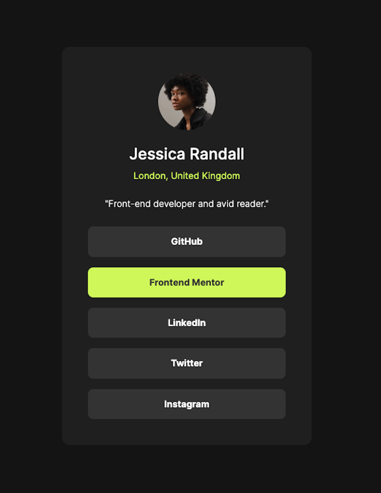

# Frontend Mentor - Social Links Profile

This is a solution to the [Social links profile challenge on Frontend Mentor](https://www.frontendmentor.io/challenges/social-links-profile-UG32l9m6dQ). Frontend Mentor challenges help you improve your coding skills by building realistic projects.

## Table of contents

- [Overview](#overview)
  - [Screenshot](#screenshot)
  - [Links](#links)
- [My process](#my-process)
  - [Built with](#built-with)
  - [What I learned](#what-i-learned)
  - [Continued development](#continued-development)
  - [Useful resources](#useful-resources)
- [Author](#author)
- [Acknowledgments](#acknowledgments)

## Overview

### Screenshot



### Links

- Solution Github Repo URL: [Solution repo](https://github.com/cepoumian/social-links-profile)
- Live Site URL: [Solution live](https://cepo-blog-preview-card.netlify.app/)

## My process

### Built with

- Web Components
- Semantic HTML5 markup
- Flexbox
- CSS custom properties
- CSS Layers

### What I learned

In this mini project, I wanted to take Web Components a bit further. The button was a good oportunity to do so.


By accepting a custom a custom URL attribute, the component can be used for all the necessary links. Also, it dispatches a custom event when clicked, which can be useful for logging or for analytics.

```js
const template = document.createElement("template");

template.innerHTML = `
  <style>
    a {
      display: inline-block;
      width: 100%;
      text-align: center;
      padding: var(--spacing-150, 0.75rem) 0;
      border-radius: var(--spacing-100, 0.5rem);
      text-decoration: none;
      font-weight: var(--fw-bold);
      background-color: var(--clr-gray-700, #333333);
      color: var(--clr-white, #ffffff);
      transition: background-color 0.3s, color 0.3s;
    }

    a:hover {
      background-color: var(--clr-green, #C4F82A);
      color: var(--clr-gray-700, #333333);
    }
  </style>
  <a target="_blank" rel="noopener noreferrer">
    <slot></slot>
  </a>
`;

class ButtonComponent extends HTMLElement {
  static get observedAttributes() {
    return ["url"];
  }

  constructor() {
    super();
    this.attachShadow({ mode: "open" });
    this.shadowRoot.appendChild(template.content.cloneNode(true));

    // Set default values
    this.defaultUrl = "#";
  }

  attributeChangedCallback(name, oldValue, newValue) {
    // Update the anchor element when the observed attributes change
    const anchor = this.shadowRoot.querySelector("a");
    if (name === "url") {
      try {
        const url = new URL(newValue, window.location.origin); // Fallback url
        anchor.href = newValue;
      } catch (error) {
        console.warn(
          `Invalid URL provided: "${newValue}". Falling back to default.`
        );
        anchor.href = this.defaultUrl;
      }
    }
  }

  connectedCallback() {
    // Apply default values when the component is added to the DOM
    const anchor = this.shadowRoot.querySelector("a");
    anchor.href = this.getAttribute("url") || this.defaultUrl;

    // Add a click event listener to emit a custom event for analytics, logging, etc.
    anchor.addEventListener("click", (event) => {
      // Prevent default navigation if the href is "#"
      if (anchor.href === "#") {
        event.preventDefault();
      }

      // Emit the custom event
      this.dispatchEvent(
        new CustomEvent("button-clicked", {
          detail: {
            url: anchor.href,
            text: anchor.textContent.trim(),
          },
          bubbles: true, // Allow the event to bubble up the DOM
          composed: true, // Allow the event to cross shadow DOM boundaries
        })
      );
    });
  }
}

customElements.define("button-c", ButtonComponent);
```

I also wanted to keep focusing on what I've learned from the [Every Layout](https://every-layout.dev/) CSS methodology.

The Every Layout book proposes an approach to layout based on classes or web components that tackle one specific task at a time. It also makes special emphasis on utilizing css logical properties (inline, block, etc.) instead of properties that would only work in horizontal-tb writing modes (e.g., margin-block-start instead of margin-top).

For example, the Stack has the single task of adding top margin:

```css
.stack {
  display: flex;
  flex-direction: column;
  justify-content: flex-start;
}

.stack > * {
  margin-block: 0;
}

.stack > * + * {
  margin-block-start: var(--spacing-sm);
}
```

The Cover has the task of centering its content vertically and horizontally:

```css
.cover {
  display: flex;
  flex-direction: column;
  min-block-size: 100vh;
  justify-content: center;
  align-items: center;
  padding: 1rem;
}
```

Finally, I also wanted to keep leveraging CSS layers as a way of organizing styles and managing specificity, as suggested by Kevin Powell in his (Frontend Master's course)[https://frontendmasters.com/courses/pro-css/].

```css
@layer utilities {
  .text\:center {
    text-align: center;
  }

  .bg\:light {
    background-color: var(--background-light);
  }
}
```

```css
@layer utilities {
  .text\:center {
    text-align: center;
  }

  .bg\:light {
    background-color: var(--background-light);
  }
}
```

### Useful resources

- [Web Components Book](https://coryrylan.gumroad.com/l/web-component-essentials?layout=profile) - One valuable resource I'm using to learn about web components.

- [Every Layout](https://www.example.com) - This is, by far, one of the most valuable resources on CSS and web layout I've found. Highly recomended.

- [Kevin Powell's Frontend Master's course](https://frontendmasters.com/courses/pro-css/) - One of CSS's greatest educators.

## Author

- Website - [Cesar Poumian](https://github.com/cepoumian)
- Frontend Mentor - [@cepoumian](https://www.frontendmentor.io/profile/cepoumian)
